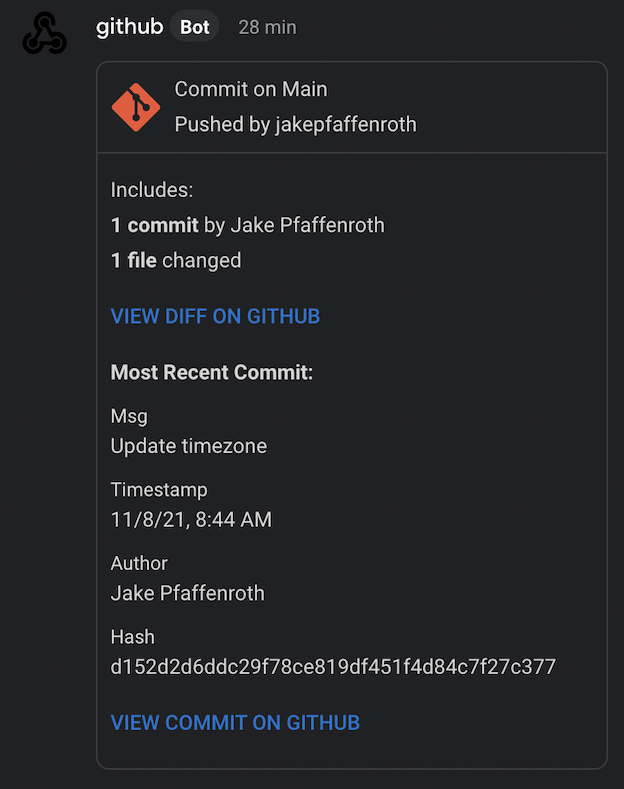

# Get Google Chat Notification on Push

This github action will automagically send a message to Google Chat containing a short summary when a push is made to the designated branch(es), with GitHub links to view a diff and the most recent commit included in the push.

## Setup

1. Copy the actions/ and workflows/ directories into the repository's .github directory.
2. Get the Google Chat webhook for the chat you want to recieve notifications in.
    - In Google Chat, click the group name to open the dropdown menu > Manage webhooks.

    

3. Save the webhook in a github secret named *gchat_webhook*.
    - On GitHub, repository settings > Secrets > New repository secret.

    

4. If necessary, cd into actions/google-chat-notification-on-push/ and npm install.
